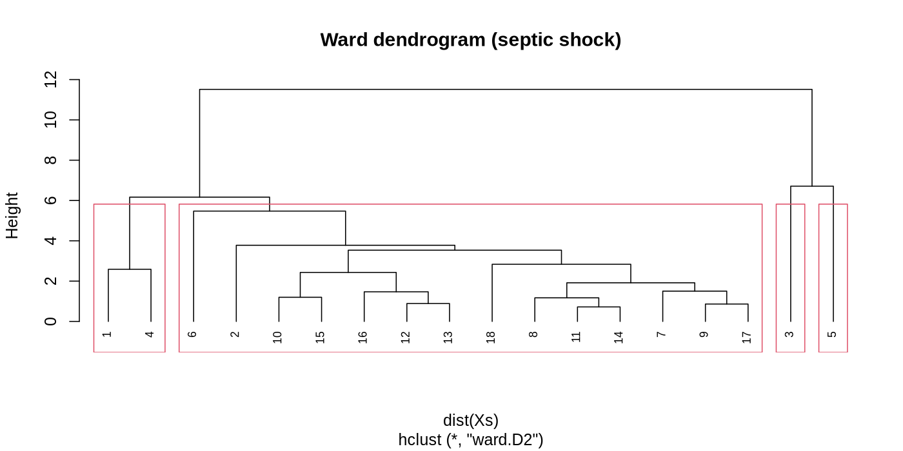
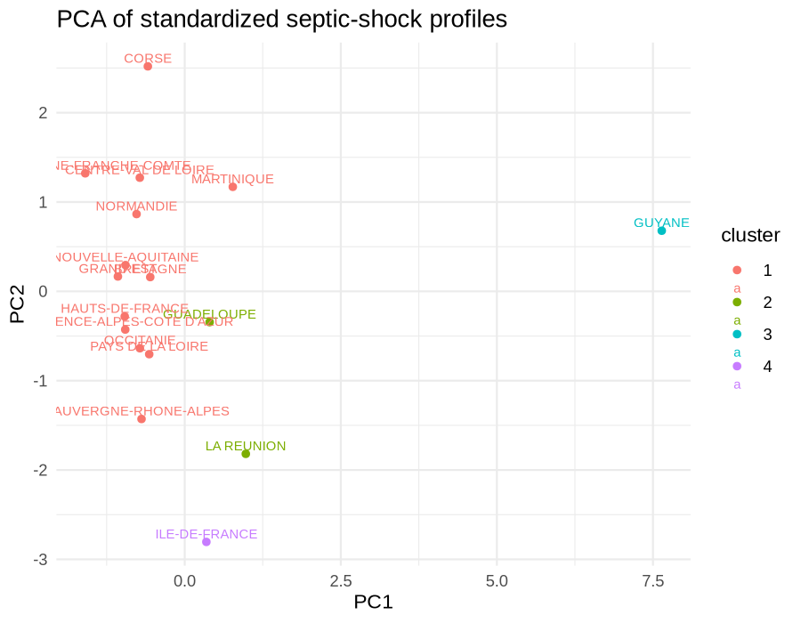
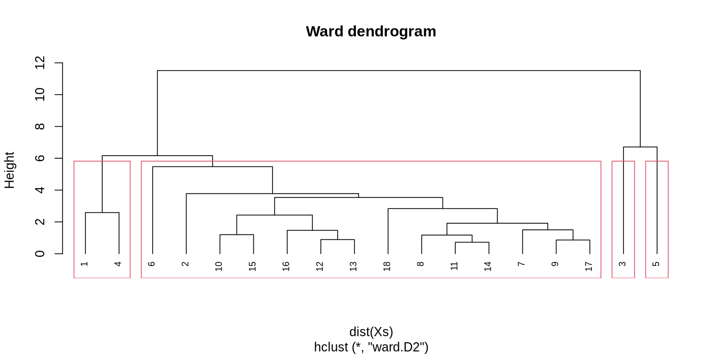
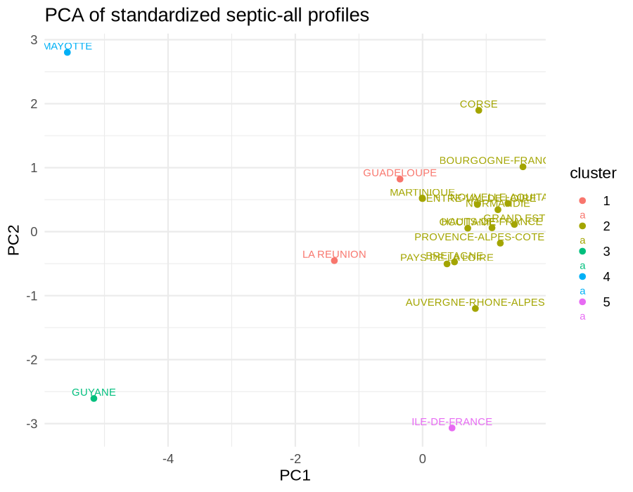

```{r}
#| label: setup
#| include: false

library(tidyverse)
library(sf)
library(readr)
library(here)
library(ggplot2)
library(patchwork)
library(knitr)
library(kableExtra)

theme_set(theme_minimal(base_size = 12))

knitr::opts_chunk$set(
  dev = "ragg_png",
  dpi = 120,
  fig.width = 7,
  fig.height = 5,
  out.width = "88%",
  fig.retina = 1
)
```

```{r}
#| include: false
source("./R/fun.R")
regions_joined <- readRDS("./data/derived/01_sepsis_spatial.RDS")
seps_dat <- readRDS("./data/derived/01_sepsis_dat.RDS")
```

# Introduction and objectives

Sepsis is not the result of a single pathogen, but a severe clinical syndrome arising from the interaction between infection, host response, and healthcare pathways. The World Health Organization defines sepsis as life-threatening organ dysfunction caused by a dysregulated response to infection, and notes that it may progress to septic shock and death, particularly in the absence of early recognition and timely treatment.

In this report, I analyse regional patterns of sepsis-related hospitalisations in France using data on hospital stays for sepsis and associated territorial indicators. The objectives are to:

1. Describe the spatial distribution of sepsis hospitalisations and outcomes across French regions.

2. Explore associations between sepsis hospitalisation rates and territorial indicators (socioeconomic, educational and urbanisation indicator from INSEE).

3. Identify homogeneous regional profiles based on septic shock rates and territorial indicators using clustering methods.

# Data sources for sepsis hospitalisations and territorial indicators

1. Sepsis hospitalisation data: data provided for this analysis, recording hospital stays for sepsis across French regions. The dataset includes indicators such as the number of sepsis-related hospital stays per 100,000 inhabitants, the percentage of deaths among sepsis stays, and the average length of stay for sepsis hospitalisations.

2. Territorial indicators: regional INSEE indicators describing socioeconomic conditions, education, and urbanisation. These include median living standard, poverty intensity, the percentage of the population aged 15 years or older who are not in education, and population density. Together, these variables provide contextual information for understanding regional differences in sepsis hospitalisation patterns. The indicator on the population aged 15 years or older who are not in education was downloaded at the commune level and aggregated to the regional level for this analysis.

Links to data sources:

- INSEE regional socioeconomic status indicators: median living standard, poverty intensity [https://www.insee.fr/fr/statistiques/7941411?sommaire=7941491](https://www.insee.fr/fr/statistiques/7941411?sommaire=7941491)
- INSEE regional education indicators: population aged 15 years or older who are not in education [https://www.insee.fr/fr/statistiques/2012692#tableau-TCRD_021_tab1_regions2016](https://www.insee.fr/fr/statistiques/2012692#tableau-TCRD_021_tab1_regions2016)
- INSEE regional urbanisation indicators: population density [https://statistiques-locales.insee.fr/#bbox=-646826,6633581,2021780,1619645&c=indicator&i=pop_depuis_1876.dens&s=2022&selcodgeo=44&t=A01&view=map3](https://statistiques-locales.insee.fr/#bbox=-646826,6633581,2021780,1619645&c=indicator&i=pop_depuis_1876.dens&s=2022&selcodgeo=44&t=A01&view=map3)


# Spatial distribution of sepsis hospitalisations and outcomes across French regions
```{r}
#| echo: false
original_labs <- readRDS("./data/derived/01_original_sepsis_labels.RDS")

to_plot <- names(select_if(seps_dat, is.numeric))

labels_names <- data.frame(original = original_labs, var_names = names(seps_dat))
labels_names<- labels_names[labels_names$var_names%in%to_plot,]

# vars <- labels_names$var_names[labels_names$var_names!="nb_sejours"]
# 
# seps_long <- 
#   seps_dat %>%
#   pivot_longer(all_of(vars), names_to = "variable", values_to = "value")
# 
# ggplot(seps_long, aes(x = reorder(region, value), y = value, fill = type_sejour_sepsis)) +
#   geom_col(position = "dodge", width = 0.75) +
#   coord_flip() +
#   facet_wrap(~ variable, scales = "free") +
#   theme_minimal(base_size = 12) +
#   theme(panel.grid.minor = element_blank())

```

## Number of sepsis-related hospital stays per 100,000 inhabitants

```{r}
#| echo: false
#| fig-cap: Nombre de séjours pour sepsis des habitants de la région pour 100 000 habitants
#| fig-height: 6
#| fig-width: 10

plot_maps_var(regions_joined, 
              var = "tx_sejours_sepsis_100k", 
              label_var = "Nombre de séjours pour sepsis des habitants de la région pour 100 000 habitants", 
              shared_legend = FALSE)


### Plot each variable
plot_one_var(data = seps_dat, 
             var_name = "tx_sejours_sepsis_100k", 
             var_label = "Nombre de séjours pour sepsis des habitants de la région pour 100 000 habitants")

```


```{r}
#| eval: false
#| fig-cap: Nombre de séjours pour sepsis des habitants de la région pour 100 000 habitants
#| fig-height: 6
#| fig-width: 10
#| include: false


## summ over the types of sepsis to get total sepsis incidence
all_sepsis <- 
  regions_joined %>%
  group_by(NOM_M) %>%
  summarise(tx_sejours_sepsis_100k = sum(tx_sejours_sepsis_100k, na.rm = TRUE))

plot_fr_var_insets(all_sepsis, 
                   var = "tx_sejours_sepsis_100k", 
                   label = "Nombre de séjours pour sepsis des habitants de la région pour 100 000 habitants", 
                   group_level = NULL)

```

There is substantial regional variation in sepsis hospitalisation rates across France. Guadeloupe stands out as the region with the highest overall sepsis hospitalisation rate (number of sepsis-related hospital stays among residents per 100,000 inhabitants), both with and without septic shock, whereas Mayotte shows the lowest rate. This pattern suggests marked territorial differences in the burden of sepsis hospitalisation across regions. 


## Mortality proportion among sepsis hospitalisations.  

```{r}
#| echo: false
#| fig-cap: Mortalité hospitalière des séjours pour sepsis (%)
#| fig-height: 6
#| fig-width: 10

plot_maps_var(regions_joined, 
              var = "pct_deces", 
              label_var = "Mortalité hospitalière des séjours pour sepsis (%)", 
              shared_legend = FALSE)

```

The percentage of deaths also varies across the regional septic shock profiles. Mayotte stands out as the profile with the highest proportion of hospital stays ending in death, whereas Guadeloupe and La Réunion show lower percentages of deaths despite relatively high septic shock hospitalisation rates. Most metropolitan regions, together with Martinique and Corse, have intermediate in-hospital mortality. These differences should be interpreted cautiously, because the percentage of deaths reflects the proportion of sepsis-related hospital stays that end in death, that is, in-hospital mortality per hospitalisation episode rather than mortality per individual patient. 

## Average length of hospital stay (DMS)

```{r}
#| echo: false
#| fig-cap: Durée moyenne de séjour (DMS)
#| fig-height: 6
#| fig-width: 10

plot_maps_var(regions_joined, 
              var = "dms_nuitees", 
              label_var = "Durée moyenne de séjour (DMS)",
              shared_legend = FALSE)

```

The average length of hospital stay (DMS) also differs across the regional septic shock profiles. Île-de-France and Guyane stand out with the longest average stays, suggesting a profile of more prolonged hospital management among septic shock hospitalisations. Mayotte shows the shortest average length of stay. DMS reflects the average duration of hospital stays for septic shock, not the duration of illness per patient, and may therefore capture both clinical severity and differences in care pathways, discharge practices, or access to hospital services.

## Mean age of patients hospitalised

```{r}
#| echo: false
#| fig-cap: âge moyen des patients hospitalisés
#| fig-height: 6
#| fig-width: 10

plot_maps_var(regions_joined, 
              var = "age_moyen", 
              label_var = "âge moyen des patients hospitalisés",
              shared_legend = FALSE)

```

The mean age of patients hospitalised for septic shock also shows clear differences between regions. Guadeloupe and La Réunion show a younger mean age, while Guyane and Mayotte stand out as regions with the youngest hospitalised patients. This indicator should be interpreted carefully, because it corresponds to the average age across all recorded hospital stays for septic shock in the region, and therefore reflects the age profile of hospitalisation episodes rather than unique individuals.

# Association between sepsis incidence and INSEE variable

## Socio-economic variable: median living standard, poverty intensity
```{r}
#| echo: false
insee_spatial <- readRDS("./data/derived/04_insee_spatial.RDS")
combined_all <- readRDS("./data/derived/04_combined_all.RDS")

plot_fr_var_insets(insee_spatial, 
                   var = "intensite_pauvrete_pct", 
                   label = "Niveau de pauvreté par région", 
                   group_level = NULL)

```


```{r}
#| echo: false

plot_fr_var_insets(insee_spatial, 
                   var = "niveau_vie_median_annuel", 
                   label = "Niveau de vie", 
                   group_level = NULL)

```


```{r}
#| echo: false
#| fig-height: 5
#| fig-width: 8

plot_scatter_y_outliers(
  combined_all,
  xvar = "tx_sejours_sepsis_100k",
  yvar = "niveau_vie_median_annuel",
  group_var = "type_sejour_sepsis",
  label_var = "region",
  detect_within_group = TRUE,
  method = "iqr",
  outlier_side = "both"
) + xlab("Nombre de séjours pour sepsis des habitants de la région pour 100 000 habitants") + 
  ylab("Niveau de vie médian annuel")


sejour_combine <- 
combined_all %>% 
  group_by(region_name) %>% 
  summarise(tx_sejours_sepsis_100k = sum(tx_sejours_sepsis_100k, na.rm = TRUE),
            niveau_vie_median_annuel = mean(niveau_vie_median_annuel, na.rm = TRUE))

```


```{r}
#| echo: false
#| fig-height: 5
#| fig-width: 8

plot_scatter_y_outliers(
  sejour_combine,
  xvar = "tx_sejours_sepsis_100k",
  yvar = "niveau_vie_median_annuel",
  group_var = NULL,
  label_var = "region_name"
) + xlab("Nombre de séjours pour sepsis des habitants de la région pour 100 000 habitants") + 
  ylab("Niveau de vie médian annuel")

```

The regional comparison suggests that sepsis hospitalisation rates tend to be higher in regions with lower median living standards and greater poverty intensity. This pattern indicates that socioeconomically disadvantaged territories may experience a greater burden of sepsis-related hospitalisations. Guadalupe, Guyane and Mayotte, are highlighted as the main outliers with high sepsis rates and worse socioeconomic indicators. 

## Educational variable: population aged 15 years or older who are not in education (pct)

```{r}
#| echo: false

plot_fr_var_insets(insee_spatial, 
                   var = "pct_non_scol15", 
                   label = "Population non scolarisée de 15 ans ou plus (pct)", 
                   group_level = NULL)


```


```{r}
#| echo: false
#| fig-height: 5
#| fig-width: 8


plot_scatter_y_outliers(
  combined_all,
  xvar = "tx_sejours_sepsis_100k",
  yvar = "pct_non_scol15",
  group_var = "type_sejour_sepsis",
  label_var = "region",
  detect_within_group = TRUE,
  method = "iqr",
  outlier_side = "both"
) + xlab("Nombre de séjours pour sepsis des habitants de la région pour 100 000 habitants") + 
  ylab("Population non scolarisée de 15 ans ou plus (pct)")


```

```{r}
#| echo: false
#| fig-height: 5
#| fig-width: 8

sejour_combine <- 
combined_all %>% 
  group_by(region_name) %>% 
  summarise(tx_sejours_sepsis_100k = sum(tx_sejours_sepsis_100k, na.rm = TRUE),
            pct_non_scol15 = mean(pct_non_scol15, na.rm = TRUE))

plot_scatter_y_outliers(
  sejour_combine,
  xvar = "tx_sejours_sepsis_100k",
  yvar = "pct_non_scol15",
  group_var = NULL,
  label_var = "region_name"
) + xlab("Nombre de séjours pour sepsis des habitants de la région pour 100 000 habitants") + 
  ylab("Population non scolarisée de 15 ans ou plus (pct)")
```

The regional comparison suggests that sepsis hospitalisation rates tend to be higher in regions with a greater share of the population aged 15 years or older who are not in education. This pattern may indicate that less advantaged educational contexts are associated with a greater burden of sepsis-related hospitalisations. However, this relationship remains descriptive and ecological, and may also reflect differences in age structure, socioeconomic conditions, baseline health, and healthcare access across regions. Guyane and Ile-de-France are highlighted as outliers with high sepsis rates and a lower share of the population not in education. 

## Urbanisation variable: Population density

```{r}
#| echo: false

plot_fr_var_insets(insee_spatial, 
                   var = "densite_pop_2022", 
                   label = "Densité de la population (nombre d'habitants au km²)", 
                   group_level = NULL)


```

```{r}
#| echo: false
#| fig-height: 5
#| fig-width: 8


plot_scatter_y_outliers(
  combined_all,
  xvar = "tx_sejours_sepsis_100k",
  yvar = "densite_pop_2022",
  group_var = "type_sejour_sepsis",
  label_var = "region",
  detect_within_group = TRUE,
  method = "iqr",
  outlier_side = "both"
) + xlab("Nombre de séjours pour sepsis des habitants de la région pour 100 000 habitants") + 
  ylab("Densité de la population (nombre d'habitants au km²)")


```


```{r}
#| echo: false
#| fig-height: 5
#| fig-width: 8

sejour_combine <- 
combined_all %>% 
  group_by(region_name) %>% 
  summarise(tx_sejours_sepsis_100k = sum(tx_sejours_sepsis_100k, na.rm = TRUE),
            densite_pop_2022 = mean(densite_pop_2022, na.rm = TRUE))

plot_scatter_y_outliers(
  sejour_combine,
  xvar = "tx_sejours_sepsis_100k",
  yvar = "densite_pop_2022",
  group_var = NULL,
  label_var = "region_name"
) + xlab("Nombre de séjours pour sepsis des habitants de la région pour 100 000 habitants") + 
  ylab("Densité de la population (nombre d'habitants au km²)")

```

The regional comparison suggests that sepsis hospitalisation rates tend to be higher in more densely populated regions. This pattern may reflect differences in urban concentration, healthcare access, hospital activity, and population composition across territories. However, this association should be interpreted cautiously, as it is based on ecological regional-level data and population density is only a proxy for urbanisation rather than a direct measure of individual risk. Ile-de-France stands out as an outlier with a very high population density and a high sepsis hospitalisation rate. 


# Regional profiles / clustering 

## Brief methods: 

To identify homogeneous regional profiles, I performed hierarchical clustering on a standardised matrix of sepsis outcomes and the INSEE territorial indicators. All numeric variables were standardised to z-scores before analysis so that variables measured on different scales contributed comparably to the distance calculation. Euclidean distance and Ward’s linkage (ward.D2) were used to group regions with similar multivariate profiles.

The number of sepsis hospitalisations and the population density variables were log transform ed to reduce skewness and improve the clustering performance. 

## 1. septic shock

Given the absence of two out of three sepsis indicators in the clustering (education and urbanisation variables) in the MAYOTTE region, I decided to exclude this region for the regional profiling based on septic shock rates, and to present the results for the remaining 17 regions. The mean silhouette scores for different numbers of clusters (k) were as follows:

- k = 2  mean silhouette = 0.6025337 
- k = 3  mean silhouette = 0.3613805 
- k = 4  mean silhouette = 0.3742333 
- k = 5  mean silhouette = 0.307849 
- k = 6  mean silhouette = 0.2445229 

Even though the highest silhouette score is for 2 groups, it largely collapses structure into “one big cluster + outliers.” I therefore present k=4 as the primary “profile” solution because it yields interpretable profiles and isolates outliers that may represent unique regional contexts. 

```{r}
#| echo: false

sum_means_tab <- read.csv("./outputs/tables/05_septic_shock_cluster_summary_means_original_k5.csv")

sum_means_tab %>% 
  mutate(across(where(is.numeric), ~ round(.x, 2))) %>%
  kable(format = "latex", booktabs = TRUE) %>%
  kable_styling(latex_options = "scale_down")

```




The 4 profiles identified are:

**Cluster A: baseline mainland profile with moderate shock rates and mid-range socioeconomic indicators — most metropolitan regions, plus Martinique and Corse**

This cluster includes most metropolitan regions together with Martinique and Corse. It is characterized by moderate septic shock rates, an older mean age than the other clusters, and mid-range socioeconomic conditions. Compared with the island and overseas outlier clusters, these regions have more favourable living standards and lower poverty intensity, while remaining relatively similar to each other in their territorial indicators.

**Cluster B: higher shock-incidence island profile — Guadeloupe and La Réunion**

This cluster is characterized by the highest hospitalisation-based septic shock rates among the multi-region groups, with an average of about 108 stays per 100,000 inhabitants. It is also associated with a younger mean age than the mainland baseline cluster and a lower percentage of in-hospital deaths. In socioeconomic terms, these regions show lower median living standard than most metropolitan regions, together with moderately high population density. Overall, this profile suggests an island context with higher observed septic shock burden, younger hospitalised patients, and a less advantaged socioeconomic environment than the mainland reference profile.

**Cluster C: very low-density overseas outlier — Guyane**

This cluster is distinguished by extremely low population density, a much younger mean age, longer hospital stays, and less favourable socioeconomic indicators than the mainland baseline cluster. At the same time, the observed septic shock hospitalisation rate is lower than in the mainland reference cluster. This profile is consistent with a territory where large distances, sparse population distribution, and healthcare access constraints may shape both hospitalisation patterns and the measured burden of septic shock. 

**Cluster D: dense, high-volume metropolitan outlier — Île-de-France**

This region stands out because of its very high population density and the largest number of septic shock stays in absolute terms. It also shows the highest median living standard and a longer average length of stay than most other regions. Its septic shock rate per 100,000 is not the highest, but the combination of large hospital volume, extreme urban density, and more favourable socioeconomic indicators makes it a clearly distinct metropolitan profile. 


```{r}
#| echo: false
```

## 2. Total sepsis

- k = 2  mean silhouette = 0.5654373 
- k = 3  mean silhouette = 0.5476771 
- k = 4  mean silhouette = 0.3579099 
- k = 5  mean silhouette = 0.3640466 
- k = 6  mean silhouette = 0.29584 

As in the only shock analysis, I choose k=5 as the primary “profile” solution because it yields interpretable profiles and isolates outliers that may represent unique regional contexts. 

```{r}
#| echo: false

sum_means_tab_all <- read.csv("./outputs/tables/05_septic_all_cluster_summary_means_original_k5.csv")

sum_means_tab_all %>% 
  mutate(across(where(is.numeric), ~ round(.x, 2))) %>%
  kable(format = "latex", booktabs = TRUE) %>%
  kable_styling(latex_options = "scale_down")

```




The 5 profiles identified are:

**Cluster A: higher-incidence island profile Guadeloupe**

This cluster is characterized by high sepsis stay rates per 100k paired with relatively lower mean age and lower percent deaths in your stay data, alongside moderately high density and lower median living standard than most metropolitan regions.

**Cluster B: “baseline” mainland profile with moderate sepsis rates and socio-economic indicators**

This cluster includes most metropolitan regions plus Corse characterised by  moderate sepsis rates, older mean age, and mid-range socioeconomic indicators. Metropolitan regions are comparatively similar on socioeconomic variables, with some variation in sepsis rates and age. 

**Cluster C: dense/high-volume metropolitan outlier - Île-de-France**

This region stands out by very high density and high stay volume, with high median living standard and a longer dms nuitees relative to most regions. It has a high sepsis rate but also better socioeconomic indicators, suggesting a unique urban profile with high healthcare access and utilization.


**Cluster D: very low-density overseas outlier - Guyane**

This region is distinctive for extremely low density, younger mean age, high dms nuitees, and worse socioeconomic indicators than the mainland cluster, with a lower sepsis rate than Cluster B in the hospitalisation-based measure. The very low density plus large distances can be associated with different access and health care pathways. 


**Cluster E: extreme-poverty overseas outlier - Mayotte**

This region is dominated by extreme poverty intensity and very low median living standard, coupled with a low observed sepsis rate in the hospitalisation data, which may reflect underdiagnosis or underutilization of hospital care for sepsis. It also has a younger mean age and high dms nuitees, suggesting a unique profile of sepsis burden and healthcare access challenges. These results should be interpreted with caution given the absence of two out of three sepsis indicators in the clustering (education and urbanisation variables) and the potential for underdiagnosis in this context.

# Next steps: 

- Explore the profiles in more depth by comparing the full multivariate profiles of each cluster, including the sepsis indicators and the territorial indicators.
- Consider alternative clustering methods (e.g. k-means, model-based clustering) and compare results. 
- Perform sensitivity analyses by including/excluding different sets of variables to see how the profiles change.
- perform a more detailed analysis of the metropolitan cluster (Île-de-France) to understand the drivers of its unique profile, and whether it can be further subdivided into meaningful subclusters. 